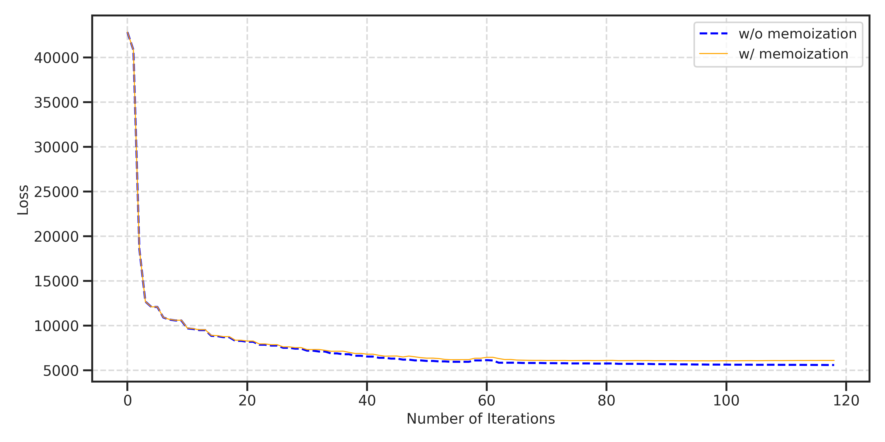
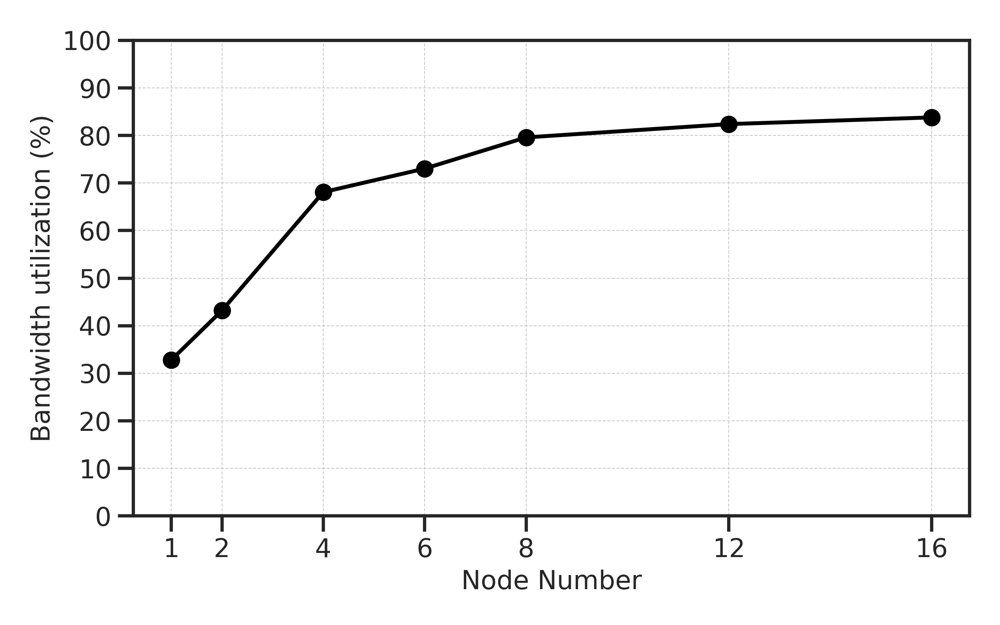

# Laminoboost 

Memoization-based Scalable Laminography Reconstruction.

## Convergence

<b>Figure 1: Convergence rate</b> 

 The convergence is tested with the dataset (1k,1k,1k) and $\tau$ = 0.95. We have two observations: 1. No additional iteration for convergence is required. 2. The methods with memozation and without memoization have the same convergence rate over iterations.

## Bandwidth 

<b>Figure 2: Scalability test with different number of nodes</b> 

The bandwidth is tested with the dataset (1k,1k,1k) reconstruction and 1-16 nodes connected by slingshot11(Max Bandwidth 200Gbps). Each node is equipped with a single AMD EPYC 7543P processor featuring 32 Zen3 cores (64 hardware threads) operating at 2.8 GHz. 

## Latency

<b>Figure 3: Latency distribution</b> 

The latency distribution is tested with the dataset (1k,1k,1k) reconstruction and 1-16 nodes connected by slingshot11(Max Bandwidth 200Gbps).
