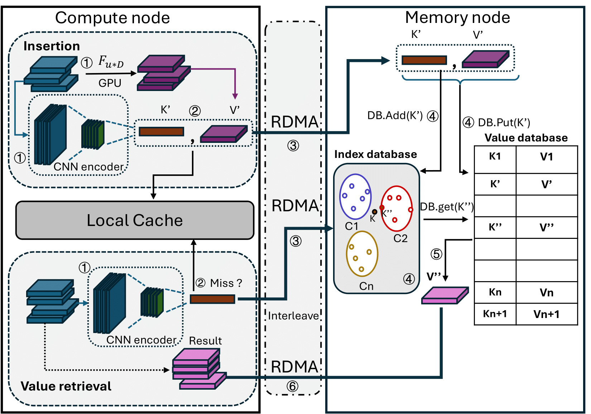

# Paper rebuttal 
## mLR: Scalable Laminography Reconstruction based on Memoization

### The general pipeline for memoization
### Figure A.1

### The Accuracy and the normalized performance with different τ
### Table C.2

| **Threshold τ** | 0.86 | 0.88 | 0.90 | 0.92 | 0.94 | 0.96 | 1.00 |
|------------------|------|------|------|------|------|------|------|
| **Accuracy**     | 0.691 | 0.808 | 0.901 | 0.946 | 0.958 | 0.973 | 1.00 |
|------------------|------|------|------|------|------|------|------|
| **Normalized Time** | 0.477 | 0.538 | 0.662 | 0.794 | 0.874 | 0.940 | 1.00 |

